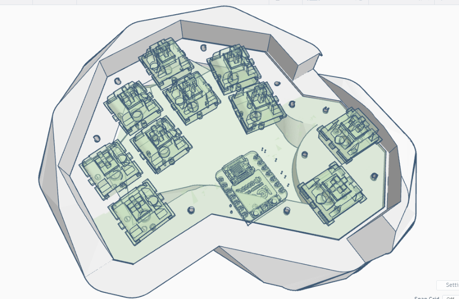
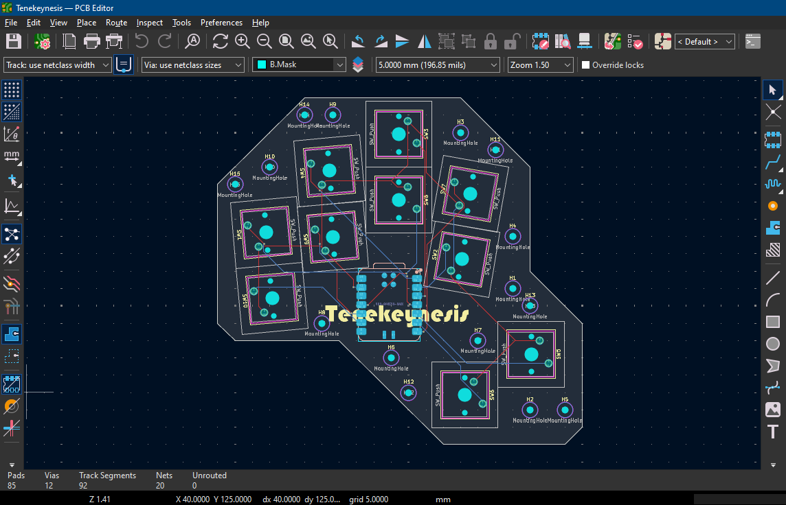
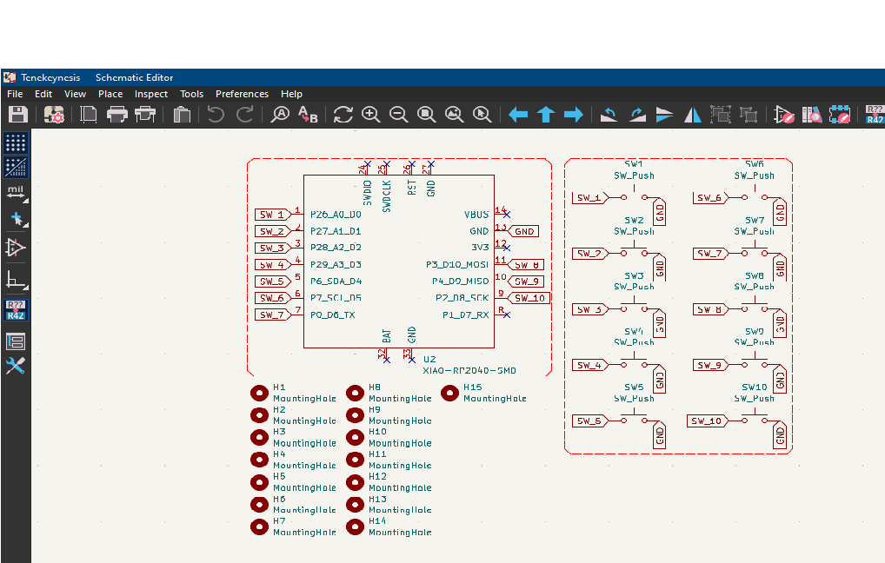

# Tenekeynesis

> A compact 10-key ergonomic macropad powered by the Seeed XIAO RP2040 and KMK firmware.

---

## About

**Tenekeynesis** combines the words **Ten Keys** and **Telekinesis**.

This project is a custom-designed macropad created from scratch, including:

- Custom PCB designed in KiCad
- Custom ergonomic case designed in Tinkercad
- KMK firmware running on a Seeed XIAO RP2040
- Compact gaming-focused layout
- Single-piece printable enclosure

The goal was to create a simple but fully custom macropad while learning PCB design, CAD, firmware development, and hardware manufacturing workflows.

---

## Features

-  10-key gaming macropad
-  Direct GPIO wiring
-  Single-piece 3D printable case
-  Cherry MX compatible
-  Powered by KMK firmware
-  Compact 100 mm × 100 mm footprint
-  2.5° ergonomic tilt
-  Fully programmable keymap

---

# CAD Model

The case was designed entirely in **Tinkercad**.

The enclosure consists of a **single printed part** which integrates:

- PCB mounting surface
- Structural support
- Ergonomic typing angle
- Mounting locations for hardware

The design uses approximately **15 × 2.1 mm screws and nuts** for assembly.

---

## Case Render



---

# Electronics

The PCB was designed in **KiCad**.

The design intentionally avoids matrix scanning and instead uses direct GPIO connections for simplicity.

### Main Components

- Seeed XIAO RP2040
- 10 Cherry MX switches
- 10 DSA keycaps

---

## PCB Layout



---

## Schematic



---

# Firmware

Tenekeynesis uses **KMK Firmware** running on the XIAO RP2040.

The firmware is intentionally lightweight and easy to modify.

---

## Default Keymap

| Switch | Output |
|----------|----------|
| SW1 | W |
| SW2 | F |
| SW3 | S |
| SW4 | A |
| SW5 | Space |
| SW6 | V |
| SW7 | D |
| SW8 | E |
| SW9 | Q |
| SW10 | Tab |

---

# Bill of Materials

| Quantity | Component |
|-----------|-----------|
| 1 | Seeed XIAO RP2040 |
| 10 | Cherry MX Switches |
| 10 | DSA Keycaps |
| 15 | 2.1 mm Screws |
| 15 | 2.1 mm Nuts |
| 1 | Custom PCB |
| 1 | 3D Printed Case |

---

# Design Goals

The project was designed around several goals:

- Keep manufacturing simple
- Stay within the Hack Club size limits
- Learn PCB design from scratch
- Create a functional gaming macropad
- Maintain an ergonomic layout

---

# Development Journey

This project started with significantly more ambitious plans, including:

- TMR sensing
- Magnetic switches
- Analog input systems
- Custom switch mechanisms

As development progressed, the design was simplified to prioritize completion, manufacturability, and reliability.

The result is a complete custom macropad that can actually be built and used.

---

# Lessons Learned

Throughout the project I learned:

- KiCad schematic design
- PCB routing
- Manufacturing file generation
- CAD modelling
- Firmware development with KMK
- Hardware design workflows

This was my first complete keyboard-style hardware project.

---

# Future Plans

Tenekeynesis is only Version 1.

Future versions may include:

- Hall-effect switches
- TMR sensing
- Rapid Trigger
- Adjustable actuation points
- RGB lighting
- Additional layers and macros

---

# Gallery

## PCB


## Case


## Schematic


---

# Files

```
Tenekeynesis/
│
├── CAD/
│   └── Tenekeynesis.step
│
├── PCB/
│   ├── Tenekeynesis.kicad_pro
│   ├── Tenekeynesis.kicad_sch
│   └── Tenekeynesis.kicad_pcb
│
├── Firmware/
│   └── code.py
│
└── Production/
    ├── gerbers.zip
    └── code.py
```

---

## Extra Stuff

Building Tenekeynesis was quite an adventure.

What started as a simple macropad evolved into learning PCB design, firmware development, CAD modelling, manufacturing workflows, and hardware engineering.

This is only the beginning.